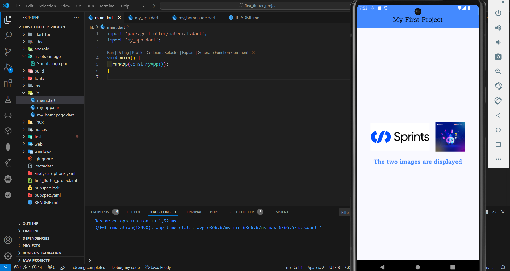

# My First Project

## Description
This Flutter project is a simple application that displays two images and customized text in the center of the screen. It is built using a `StatelessWidget` to showcase a basic implementation of Flutter widgets like `AppBar`, `Column`, `Row`, and `Image`.

## Features
- Displays a title at the top of the page using an `AppBar`.
- Shows two images:
  - One image is loaded from the project's asset files.
  - The other image is loaded from an internet URL.
- Positions the two images in the same row with a gap between them.
- Displays a text message below the images with the following customizations:
  - Font: `Suwannaphum-Regular`
  - Font size: `20`
  - Text color: `blueAccent`
  - Bold styling
- All elements are centered on the screen.
- Each class/widget is in a separate file

## Requirements
- Ensure that the `assets` folder contains the image file `assets/images/SprintsLogo.png`.
- Include the `Suwannaphum` font in the project's `pubspec.yaml` file.

## Code Explanation
### Main Function
The `main` function initializes the app by running the `MyApp` widget.

### `MyApp` Widget
This is a `StatelessWidget` that sets up the `MaterialApp` configuration, including:
- Disabling the debug banner.
- Setting a custom theme with `Suwannaphum` font and `blueAccent` as the primary color.
- Defining the home page as `MyHomePage`.

### `MyHomePage` Widget
This is a `StatefulWidget` that represents the main screen of the app. It consists of:
1. **AppBar**:
   - Displays the title "My First Project" at the top of the page with a custom background color.
2. **Body**:
   - A `Column` widget centered on the screen.
   - A `Row` widget containing:
     - An image from the asset files.
     - An image loaded from the internet.
   - A `Text` widget below the images with customized styles.
   - Spacing between elements for a clean layout.

### Sample Output
